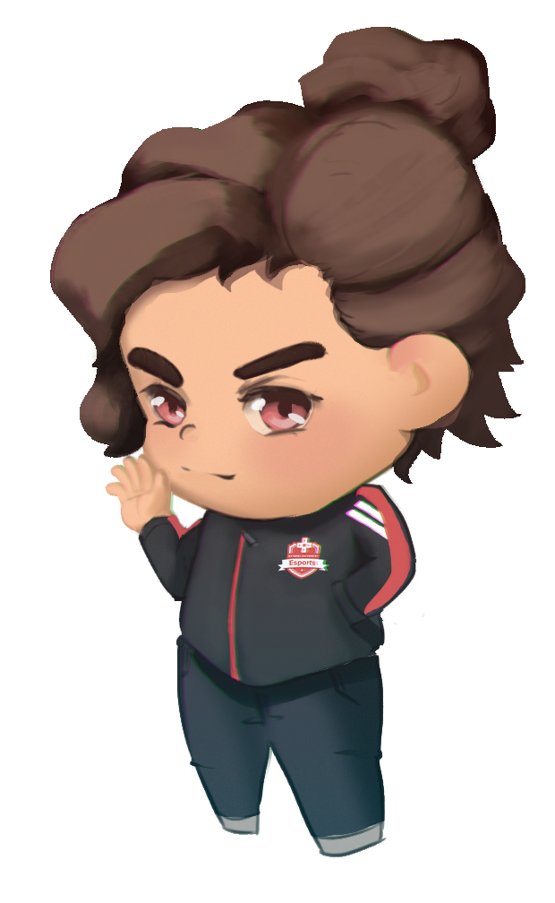

# Rutgers-kun and Rutgers Esports

It might be a bit confusing contributing to this project as a member of Rutgers Esports since Rutgers-kun and Rutgers Esports are almost entirely separate. Hopefully this document will clear up some questions. This document may be expanded upon in the future with more information.

## Committees
- [Technology](#contributing-as-a-member-of-rutgers-esports)
- [Content Creation](#branding-and-rutgers-kun)

## Contributing as a member of Rutgers Esports
*Technology Committee*
### Do:
- **Communicate.** Keep open lines of communication with server owners hosting Rutgers-kun. This bot works in many big Rutgers servers, so it's important that it's working in and out of the Rutgers Esports server.
- **Document everything.** Every bugfix warrants an [issue](https://github.com/sriRacha21/Rutgers-kun3/issues). Every major feature addition warrants an associated feature branch and [pull request](https://github.com/sriRacha21/Rutgers-kun3/pulls). Test features and bugfixes before merging to master. *Only* work on master to fix critical vulnerabilities/bugs.
    - Write **detailed commit messages.** This isn't your school project. Try to document the changes you made for each commit and/or link the issues you're fixing in your commit messages. Look at [Discord.js's commit history](https://github.com/discordjs/discord.js/commits/master) if you want to get an idea of how Rutgers-kun commit's should look.
- **Write good code.** Ensure whatever code you add passes the linter, and ensure all possible promise rejections are handled accordingly. Assume the bot always has the minimum permissions and consider directing the user to elevate the bot's permissions if needed.
    - **Ensure reworked content never breaks.** If an old system is being reworked that's fine, but don't allow servers that make no changes to suddenly have their user entry flow broken, even if an announcement is being made in the development server. There will always be servers that run Rutgers-kun and have no lines of communication with you and we want to ensure the bot works for them too.
    - **Consult the documentation.** [Discord.js](https://discord.js.org/#/docs/main/stable/general/welcome) and [Commando](https://discord.js.org/#/docs/commando/master/general/welcome) have incredible documentation. I suggest you keep the documentation on the side as you program.
    - **Use the command framework.** Commando is a very valuable asset to this project. If you need a new argument type or new command don't just tack it all onto `main.js` and hope for the best. 
- **Ask questions!** Nobody is a perfect programmer. Have a question about the library or best design patterns/practices? Feel free to ask long-time contributors in [Rutgers-kun's development server](https://discord.gg/ydepndv).

### Don't:
- **Advertise.** Do not use the bot to advertise Rutgers Esports events, clubs, or Discord server. A single presence or command is fine, but any more than that is turning Rutgers-kun into an ad bot.
- **Add bloat.** Keep features that other bots have that are added to Rutgers-kun to a minimum. When answering issues, reviewing PR's, or thinking about new features for Rutgers-kun just keep in mind that if another bot has a certain functionality it's almost certainly not worth adding. Use your best discretion when adding features. Not every new feature idea is a good fit for Rutgers-kun.
    - **Rutgers Esports Officer Utility:** I've read some talks about adding officer-only functionality in Rutgers-kun for things such as inventory management. At this time, this is fine to add *as long as* these features are [hidden](https://discord.js.org/#/docs/commando/master/class/Command?scrollTo=hidden) from and [unusable](https://discord.js.org/#/docs/commando/master/class/Command?scrollTo=userPermissions) by non-officers. I recommend maintaining separate documentation for commands added this way.
- **Try porting the bot outside of JS/TS.** If you prefer Python (or some other language) and want to replicate Rutgers-kun's functionality in a bot that's fine but that'd be an entirely separate project. We want to minimize the amount of code we have to write to get things done and still have clean and maintainable code, so JS ends up being the best tool for the job.

## Branding and Rutgers-kun
*Content Creation Committee*

When Rutgers-kun is transferred over to Rutgers Esports, I'd like Content Creation to handle the bot's branding, which is admittedly not all that much work. I'd like the following rules to be followed with respect to Rutgers-kun's branding:

- Appearance / Likeness
    - Profile picture
        - Never use a logo as Rutgers-kun's profile picture. Rutgers-kun is a male (he/him) mascot. Always include a face in Rutgers-kun's profile picture.
        - Do not automate or frequently change Rutgers-kun's profile picture. It's important that the bot is quickly and easily recognizeable.
    - Clothing
        - Rutgers-kun's clothing should always have a red accent to represent Rutgers Esports. For future iterations of Rutgers-kun, feel free to keep or lose the officer jacket.
- Logos
    - The current horizontal logo (and profile picture) were super rushed. Feel free to create new ones if you want to make it more consistent with Rutgers Esports branding.
- External media
    - Any external media referencing Rutgers-kun such as the website or printed material should use its name (Rutgers-kun) *and* prominently display its current profile picture if possible.